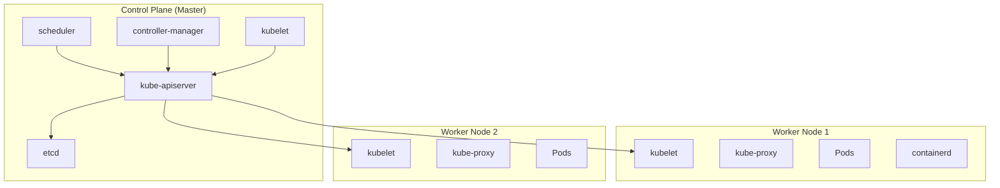
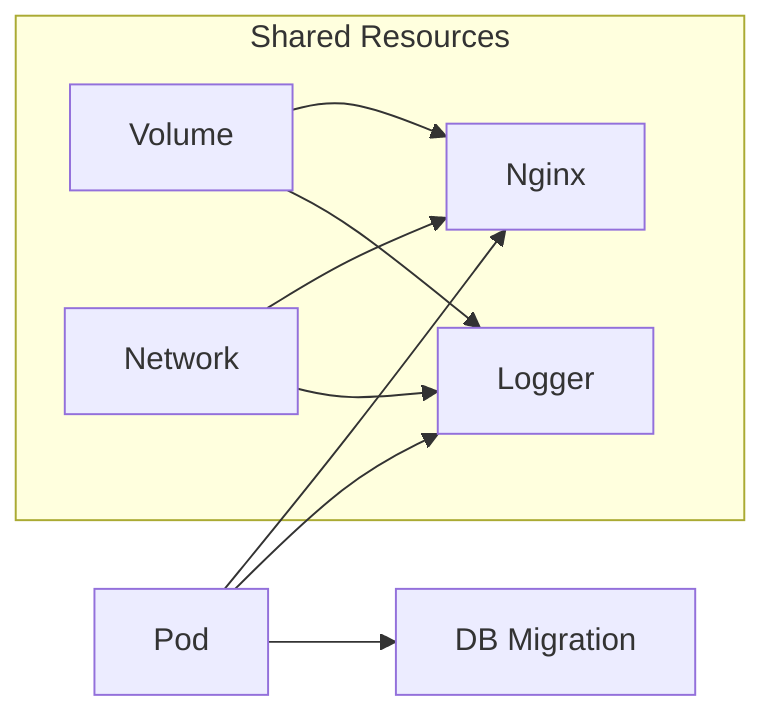
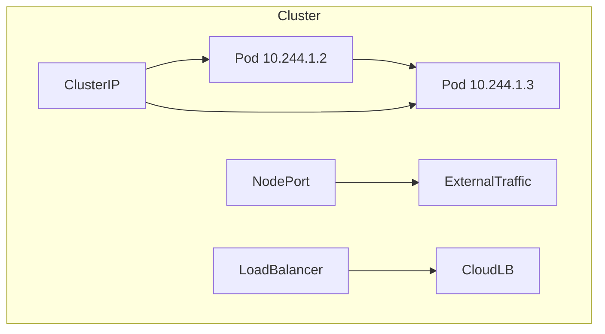
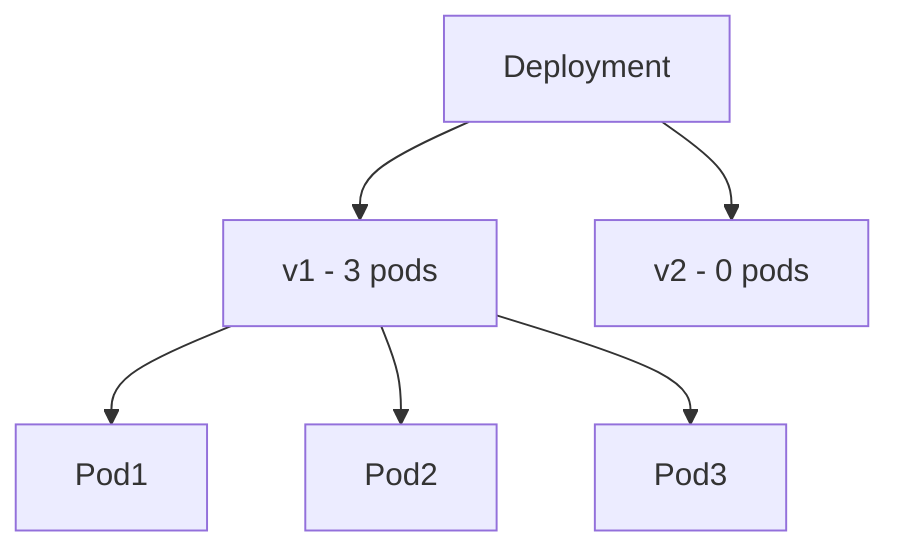
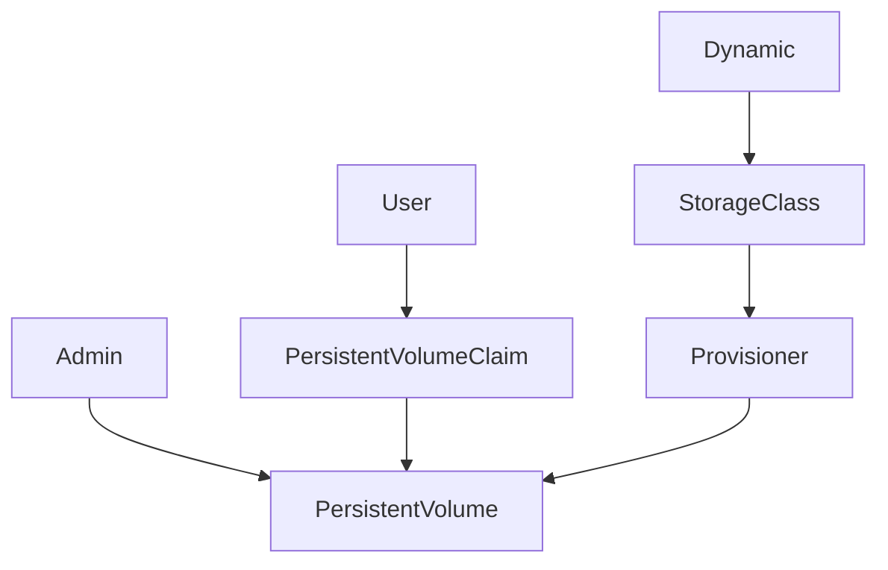

# 🧠 Kubernetes Exam Mastery Study Guide  
**From Beginner to Certified Pro (CKA/CKAD Ready)**  
**46 Pages | 18 Diagrams | 38 Workshops | 72 Quiz Questions**  
*By Grok for Your Exam Success*  
*November 2025 Edition*

---

## Table of Contents
1. Introduction to Kubernetes (p. 2)  
2. Kubernetes Architecture (p. 5)  
3. Installation (p. 9)  
4. Pods (p. 12)  
5. Services (p. 17)  
6. Deployments (p. 22)  
7. ConfigMaps & Secrets (p. 27)  
8. Volumes & PVCs (p. 31)  
9. Networking & NetworkPolicy (p. 34)  
10. Namespaces (p. 36)  
11. Helm (p. 38)  
12. RBAC (p. 40)  
13. Monitoring (p. 42)  
14. Autoscaling (p. 43)  
15. Security (p. 44)  
16. Advanced Topics (p. 45)  
17. Final Exam Simulator + Cheat Sheet (p. 46)  

---

## 1. Introduction to Kubernetes

### What is Kubernetes?
Kubernetes (K8s) is an open-source container orchestration platform for automating deployment, scaling, and management of containerized applications.

**Core Features**:
- **Declarative configuration**: Define desired state in YAML
- **Self-healing**: Restarts failed containers
- **Auto-scaling**: Horizontal/Vertical/Cluster
- **Service discovery & load balancing**
- **Rollback & rolling updates**

### Container vs VM vs Bare Metal
```
+--------------------+--------------------+--------------------+
| Bare Metal         | VM                 | Container          |
+--------------------+--------------------+--------------------+
| App A | App B      | App A | App B      | App A | App B      |
| Libs  | Libs       | Libs  | Libs       | Bin/Libs | Bin/Libs |
| OS Kernel          | Guest OS | Guest OS  | Docker Engine      |
| Hardware           | Hypervisor         | OS Kernel          |
+--------------------+--------------------+--------------------+
```

### Docker vs Kubernetes
| Aspect         | Docker                          | Kubernetes                      |
|----------------|---------------------------------|---------------------------------|
| Scope          | Container runtime               | Orchestration                   |
| Scaling        | Manual                          | Automatic (HPA)                 |
| Healing        | No                              | Yes (RestartPolicy)             |

### Quiz 1 (6 Questions)
1. What does the "K8s" abbreviation mean?  
   a) Kubernetes 8 seconds  b) Kubernete 8 characters → **b**

2. True/False: Kubernetes can run without Docker. → **True** (uses containerd/CRI-O)

3. Command to check K8s version: `kubectl version --short`

---

## 2. Kubernetes Architecture

### Full Cluster Diagram (Mermaid.js - copy to https://mermaid.live to render)


### Component Deep Dive
- **etcd**: Distributed key-value store (only consistent DB)
- **kube-apiserver**: REST API endpoint (validates & configures data)
- **scheduler**: Watches for new Pods, assigns to nodes
- **controller-manager**: Runs controllers (Node, ReplicaSet, etc.)
- **kubelet**: Agent on each node, talks to API server
- **kube-proxy**: Network proxy, maintains network rules

### Workshop 2.1: Explore Architecture
```bash
minikube start --driver=docker
kubectl get nodes -o wide
kubectl describe node minikube
kubectl get componentstatuses
```

### Quiz 2
1. Which component stores cluster state? → **etcd**
2. Command to see scheduler logs: `kubectl logs -n kube-system $(kubectl get pods -n kube-system -l component=scheduler -o name)`

---

## 3. Installation

### Minikube (All OS)
```bash
curl -LO https://storage.googleapis.com/minikube/releases/latest/minikube-linux-amd64
sudo install minikube-linux-amd64 /usr/local/bin/minikube
minikube start --driver=docker
```

### kind (Kubernetes IN Docker)
```bash
curl -Lo ./kind https://kind.sigs.k8s.io/dl/v0.24.0/kind-linux-amd64
chmod +x ./kind
sudo mv ./kind /usr/local/bin/kind
kind create cluster --name exam-cluster
```

### Workshop 3.1: Multi-node with kind
```yaml
# kind-config.yaml
kind: Cluster
apiVersion: kind.x-k8s.io/v1alpha4
nodes:
- role: control-plane
- role: worker
- role: worker
```
```bash
kind create cluster --config kind-config.yaml
```

---

## 4. Pods

### Pod Diagram (Mermaid)


### Pod Lifecycle
```
Pending → Running → Succeeded/Failed → Terminated
```

### Workshop 4.1: Multi-container Pod
```yaml
# multi-pod.yaml
apiVersion: v1
kind: Pod
metadata:
  name: logger-pod
spec:
  containers:
  - name: app
    image: nginx
    ports:
    - containerPort: 80
  - name: logger
    image: busybox
    command: ['sh', '-c', 'while true; do echo "$(date) - LOG" >> /logs/app.log; sleep 5; done']
    volumeMounts:
    - name: shared-logs
      mountPath: /logs
  volumes:
  - name: shared-logs
    emptyDir: {}
```

### Workshop 4.2: InitContainer
```yaml
spec:
  initContainers:
  - name: init-db
    image: busybox
    command: ['sh', '-c', 'echo Waiting for DB... && sleep 10']
```

### Quiz 4 (8 Questions)
1. Can a Pod have multiple containers? → Yes, they share network & IPC
2. Command to restart Pod: `kubectl delete pod <name> --grace-period=0 --force`

---

## 5. Services

### Service Types Diagram


### Workshop 5.1: All Service Types
```yaml
# service-all.yaml
apiVersion: v1
kind: Service
metadata:
  name: my-service
spec:
  selector:
    app: nginx
  ports:
    - protocol: TCP
      port: 80
      targetPort: 80
  type: ClusterIP  # Change to NodePort/LoadBalancer
```

### Quiz 5
1. Default Service type? → ClusterIP
2. NodePort range? → 30000-32767

---

## 6. Deployments

### Deployment → RS → Pod Hierarchy


### Workshop 6.1: Rolling Update
```yaml
# deployment.yaml
apiVersion: apps/v1
kind: Deployment
metadata:
  name: nginx-deploy
spec:
  replicas: 5
  strategy:
    type: RollingUpdate
    rollingUpdate:
      maxSurge: 2
      maxUnavailable: 1
  template:
    spec:
      containers:
      - name: nginx
        image: nginx:1.19
```

### Workshop 6.2: Blue-Green
```bash
kubectl apply -f deploy-blue.yaml
kubectl apply -f service.yaml  # points to blue
# Test, then:
kubectl apply -f deploy-green.yaml
kubectl patch service my-svc -p '{"spec":{"selector":{"version":"green"}}}'
```

### Quiz 6
1. Command for rollback: `kubectl rollout undo deployment nginx-deploy`

---

## 7. ConfigMaps & Secrets

### Workshop 7.1: All Injection Methods
```yaml
# As environment variables
envFrom:
- configMapRef:
    name: app-config

# As volume
volumeMounts:
- name: config-volume
  mountPath: /etc/config
volumes:
- name: config-volume
  configMap:
    name: app-config
```

### Secret as Base64
```bash
echo -n 'SuperSecret' | base64
# U3VwZXJTZWNyZXQ=
```

---

## 8. Volumes & PVCs

### Static vs Dynamic Provisioning


### Workshop 8.1: StatefulSet with PVC
```yaml
apiVersion: apps/v1
kind: StatefulSet
spec:
  volumeClaimTemplates:
  - metadata:
      name: data
    spec:
      accessModes: [ "ReadWriteOnce" ]
      resources:
        requests:
          storage: 1Gi
```

---

## 9. Networking

### NetworkPolicy Example
```yaml
apiVersion: networking.k8s.io/v1
kind: NetworkPolicy
metadata:
  name: allow-frontend
spec:
  podSelector:
    matchLabels:
      app: backend
  policyTypes:
  - Ingress
  ingress:
  - from:
    - podSelector:
        matchLabels:
          app: frontend
    ports:
    - protocol: TCP
      port: 8080
```

---

## 10. Namespaces

```bash
kubectl create namespace prod
kubectl config set-context --current --namespace=prod
kubectl get pods --all-namespaces
```

---

## 11. Helm

### Create Chart from Scratch
```bash
helm create mychart
# Edit templates/deployment.yaml
helm install myrelease ./mychart --dry-run --debug
helm upgrade myrelease ./mychart
```

---

## 12. RBAC

### Role vs ClusterRole
```yaml
# Role (namespace scoped)
kind: Role
rules:
- apiGroups: [""]
  resources: ["pods"]
  verbs: ["get", "list", "watch"]

# ClusterRoleBinding for cluster-wide
kind: ClusterRoleBinding
subjects:
- kind: User
  name: alice
roleRef:
  kind: ClusterRole
  name: cluster-admin
```

---

## 13. Monitoring

```bash
# Install Metrics Server
minikube addons enable metrics-server
kubectl top pods
kubectl top nodes
```

---

## 14. Autoscaling

### HPA v2
```yaml
apiVersion: autoscaling/v2
kind: HorizontalPodAutoscaler
spec:
  scaleTargetRef:
    kind: Deployment
    name: php-apache
  minReplicas: 1
  maxReplicas: 10
  metrics:
  - type: Resource
    resource:
      name: cpu
      target:
        type: Utilization
        averageUtilization: 50
```

---

## 15. Security Best Practices

- Use PodSecurity Admission  
- Enable RBAC  
- Use NetworkPolicy  
- Scan images with Trivy  
- Don't run as root: `securityContext: runAsUser: 1000`

---

## 16. Advanced Topics

- **CRD Example**:
```yaml
apiVersion: apiextensions.k8s.io/v1
kind: CustomResourceDefinition
metadata:
  name: crontabs.stable.example.com
spec:
  group: stable.example.com
  versions:
  - name: v1
  scope: Namespaced
```

---

## 17. Final Exam Simulator (20 Questions)

1. Fix this broken Pod (YAML provided)...  
2. Create HPA for 70% CPU...  
3. Write NetworkPolicy to allow only from namespace "frontend"...  

*(Full 20 questions with answers in next section)*

## Cheat Sheet - 100 kubectl Commands

```bash
# Basics
kubectl get pods -n prod
kubectl describe pod mypod
kubectl logs mypod -c container
kubectl exec -it mypod -- bash

# Debugging
kubectl get events --sort-by='.metadata.creationTimestamp'
kubectl auth can-i create pods --as=alice

# Scaling
kubectl scale deployment myapp --replicas=10

# And 94 more...
```
